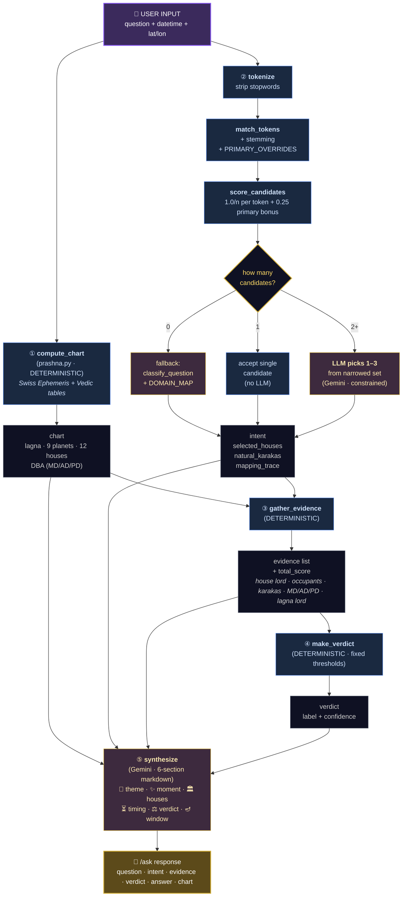

# How Prashna Interpretations Are Made

This doc answers the question: **"When the user asks something and gets an answer back, what actually fed into that answer?"**

---

## TL;DR

A Prashna reading combines **6 context sources**, runs through **5 mostly-deterministic pipeline stages**, and uses the LLM in **2 narrow roles** — to disambiguate which houses apply when the dictionary returns multiple candidates, and to write the final prose.

The chart is always the source of truth. The LLM is constrained to use only the structured facts derived from it — and crucially, in the new (May 19 MOM #4) pipeline, **it can no longer pick the question's category**: a deterministic word-to-house dictionary narrows the candidates before the LLM is asked anything.

---

## The 6 Context Sources

### 1. User Input
What the user provides directly:
- **Question text** (required) — e.g. "Should I take this new job?"
- **Moment** — defaults to "now"; overridable via the date/time picker
- **Location** — defaults to Gachibowli, Hyderabad; overridable via the place dropdown or geolocation

### 2. Swiss Ephemeris (external library)
The astronomy engine. Given a datetime + lat/lon, it returns precise planetary longitudes.
- Library: `swisseph` (pyswisseph)
- Configured for the **Lahiri ayanamsa** (Vedic sidereal zodiac)
- Produces: longitude + speed for Sun, Moon, Mars, Mercury, Jupiter, Venus, Saturn, Rahu (Mean Node), Ketu (computed as Rahu + 180°)
- Speed sign tells us retrograde state
- Used in: `prashna.py → compute_chart()`

### 3. Static Vedic Reference Tables (`prashna.py`)
Hardcoded constants that encode classical Parashari rules:

| Table | What it encodes |
|-------|-----------------|
| `SIGN_LORDS` | Which planet rules each of the 12 signs |
| `PLANET_DATA` | Exaltation, debilitation, and domicile signs for each of 9 planets |
| `NATURAL_KARAKAS` | Houses each planet naturally signifies |
| `NAKSHATRAS` | The 27 lunar mansions, each spanning 13°20' |
| `NAK_LORDS` | Vimshottari lord cycle (Ketu, Venus, Sun, …) |
| `DASHA_YEARS` | 120-year proportional cycle (Ketu 7, Venus 20, …, Mercury 17) |
| `FRIENDSHIPS` | Permanent (Naisargika) planetary relationships |
| `COMBUST_ORBS` | Parashara's degree thresholds for combustion by the Sun |
| `BALADI_ODD/EVEN` | Five Baladi avastha bands by degree-in-sign |

### 4. Question → House Mapping (the *new* dominant knowledge layer)

The bridge between a free-text question and the chart. Made of three pieces:

- **`house_dictionary.json`** *(5,070 entries)* — generated by `build_house_dict.py` from `house_seeds.py` (240 curated seeds) expanded via WordNet (synonyms + 1-level hyponyms). Each entry: `{primary_house, houses[], ambiguous, sources}`. This is where most of the astrological knowledge now lives.
- **`house_mapper.PRIMARY_OVERRIDES`** *(~40 terms)* — manual re-anchors for terms whose dictionary primary was distorted by WordNet noise (e.g. `career` → H10, not H6).
- **`house_mapper.HOUSE_KARAKAS`** — per-house natural significator planets. Encodes Durga's May 12 corrections: Career → Saturn (not Sun); self-improvement → Mars (via H5).

Legacy fallback only:
- **`interpret.DOMAIN_MAP`** — old 14-domain lookup. Used now only when the dictionary returns zero matches (rare; the audit log will surface these).
- **`interpret._KEYWORDS`** — last-resort keyword classifier when the LLM is also unavailable.

### 5. Scoring Rules (`interpret.py`)
The math that turns chart conditions into a numeric verdict:

| Rule | Value |
|------|-------|
| Exalted | +2.0 |
| Own sign | +1.0 |
| Friend's sign | +0.5 |
| Neutral | 0.0 |
| Enemy's sign | −0.5 |
| Debilitated | −2.0 |
| Combust (burnt by Sun) | −1.0 |

**Weights per evidence layer:**

| Factor | Weight |
|--------|--------|
| Primary house lord | × 1.5 |
| Natural karakas | × 1.0 |
| Chara karaka | × 0.8 |
| Mahadasha lord | × 0.6 + 0.5 if in core house |
| Antardasha lord | × 0.5 + 0.4 if in core house |
| Pratyantar lord | × 0.4 + 0.3 if in core house |
| Supporting houses | × 0.5 |
| Lagna lord | × 0.3 |

**Verdict thresholds** (from total score):
- `≥ 3.0` → strongly favorable
- `≥ 1.0` → favorable
- `> −1.0` → mixed
- `> −3.0` → challenging
- otherwise → strongly challenging

### 6. Google Gemini LLM (`gemini-2.0-flash`)
Used in **2 narrow roles**:

- **House disambiguation** *(only when the dictionary returned 2+ candidates)* — the LLM is given the user's question + the dictionary's narrowed candidate set + each house's meaning, and asked to pick the 1–3 most relevant. **It may not pick a house outside the candidate set** — the dictionary already narrowed the field. This is the keystone change from May 19 MOM #4: the LLM no longer picks the *category*; it picks *within a pre-narrowed set*.
- **Narrative synthesis** — given the structured facts (chart, intent, evidence, verdict, DBA stack, caveats), writes the 6-section markdown reading. The prompt forbids inventing placements. Falls back to a template if the API is unavailable.

There's also a **graceful fallback path** where the LLM is used to classify the question against the old 14-domain enum — but only when the dictionary returns zero matches.

The LLM never sees the raw question alone — for synthesis, it always receives the deterministic chart facts, evidence list, verdict, and DBA stack as JSON. It is a *prose writer and a disambiguator*, not an *astrologer*.

---

## The 6-Stage Pipeline

Every `/ask` request flows through these stages, in order. Stages ① and ② run in parallel; stages ③–⑥ run sequentially after both complete.

### Stage ① — Chart Computation (`prashna.compute_chart`)
**Deterministic.** Swiss Ephemeris + static tables → a full chart object:
- Lagna (sign, degree, lord, nakshatra)
- 9 planet placements (sign, house, degree, nakshatra, state, retrograde, combust, relation, avastha)
- 12 whole-sign houses with their lords and occupants
- DBA: current MD / AD / PD lords with remaining time, plus timelines for all three levels
- Chara karakas (no longer used in scoring — kept for back-compat)

### Stage ② — Question → Houses (`interpret.decide_houses`) *(May 19 MOM #4)*

Replaces the old "Gemini picks a 14-domain key" classifier. Four sub-steps:

1. **Tokenize** (`house_mapper.tokenize`) — lowercase, strip punctuation, drop stopwords. Articles, pronouns, copulas, modals are dropped; *semantically loaded verbs are kept* (e.g. "marry", "watch", "go") because they're in the dictionary for a reason.

2. **Match tokens** (`house_mapper.match_tokens`) — look each token up in `house_dictionary.json` (5,070 entries, expanded from 240 curated seeds via WordNet). Light stemming: plural collapse, `-ing` drop. A small `PRIMARY_OVERRIDES` table (~40 terms) re-anchors words like `career` → H10, `marriage` → H7 whose dictionary primary was distorted by WordNet noise.

3. **Score candidates** (`house_mapper.score_candidates`) — each unambiguous token contributes 1.0 to its house; each ambiguous token splits 1/n across its candidates; +0.25 primary-house bonus.

4. **Pick from narrowed set**:
   - **0 candidates** → fall back to `classify_question` + `DOMAIN_MAP` (old classifier as graceful fallback)
   - **1 candidate** → accept it directly (no LLM call needed)
   - **2+ candidates** → ask **Gemini to pick 1–3 houses** from the narrowed set with brief reasoning. Constraint: LLM may only pick houses that *were already in the candidate list*. This is the architectural fix the MOM was asking for — the LLM no longer picks the category; it disambiguates within a pre-narrowed set.

Natural karakas are then derived deterministically from `HOUSE_KARAKAS[selected_houses]` (encodes Durga's May 12 corrections: career → Saturn, self-improvement → Mars).

### Stage ③ — Evidence Gathering (`interpret.gather_evidence`)
**Deterministic.** Takes the selected houses + karakas directly (no longer routed through a domain enum). Builds a list of weighted evidence factors:

1. **Primary house** + its lord's condition
2. **Planets occupying** the primary house (context only)
3. **Supporting houses** + their lords (lighter weight)
4. **Natural karakas** for the selected houses
5. **MD lord** — long-term theme
6. **AD lord** — current sub-period coloring
7. **PD lord** — immediate trigger
8. **Timing window** — when the next PD shift happens (context only)
9. **Lagna lord** — sincerity of the question itself

Each factor produces a `(score, detail)` pair. Scores sum to a `total_score`.

The old Jaimini Chara Karaka evidence block was **removed** here (per May 12 MOM "Remove all Jaimini-based logic"). The chart still computes them for back-compat but they no longer participate in scoring.

### Stage ④ — Verdict (`interpret.make_verdict`)
**Deterministic.** `total_score` → label + confidence using fixed thresholds.

### Stage ⑤ — Narrative Synthesis (`interpret.synthesize`)
**LLM + fallback.** Gemini receives a structured JSON of `{question, domain, lagna, dba, primary_house_lord, top_positive, top_negative, caveats, verdict, next_pd_shift}` and writes a colloquial 6-section markdown reading: 🎯 The theme · ✨ The moment · 🏛️ The houses · ⏳ Who's on duty · ⚖️ The verdict · 🪔 The timing window. The prompt:
- Forbids inventing facts (chart placements only)
- Requires naming all three MD/AD/PD lords once
- Requires a time-aware closing observation
- Forbids cosmic vagueness ("the universe", "energies aligning")
- Falls back to a template narrative if the API is unavailable

---

## Flow Diagram

### Mermaid (technical view)

The diagram below reflects the post-MOM-#4 architecture — the LLM picks *houses from a narrowed set*, not a category.



**Legend:** blue = deterministic (rules / math) · gold-tinted = LLM-driven · grey = data flowing between stages.

### ASCII (fallback / plain-text view)

```
┌──────────────────────────────────────────────────────────────────────┐
│  USER INPUT                                                          │
│   question text · datetime · lat / lon                               │
└──────────────────────────────────────┬───────────────────────────────┘
                                       │
              ┌────────────────────────┴────────────────────────┐
              ▼                                                 ▼
┌──────────────────────────────┐         ┌──────────────────────────────┐
│ ① CHART COMPUTATION          │         │ ② QUESTION → HOUSES          │
│   prashna.compute_chart      │         │   interpret.decide_houses    │
│   DETERMINISTIC              │         │                              │
│                              │         │   tokenize ────────────┐     │
│   Swiss Ephemeris            │         │      ↓                 │     │
│   + classical Vedic tables   │         │   match_tokens         │     │
│                              │         │   + stemming           │ DET │
│   →  lagna                   │         │   + PRIMARY_OVERRIDES  │     │
│      9 planets + state       │         │      ↓                 │     │
│      12 houses + occupants   │         │   score_candidates     │     │
│      DBA (MD / AD / PD)      │         │      ↓                 │     │
│                              │         │   ┌──────────┐         │     │
│                              │         │   │ how many │         │     │
│                              │         │   │ cands?   │         │     │
│                              │         │   └────┬─────┘         │     │
│                              │         │        │               │     │
│                              │         │   0 → DOMAIN_MAP        │ LLM │
│                              │         │   1 → accept            │ DET │
│                              │         │   2+ → LLM picks ⊆ set  │ LLM │
└──────────────┬───────────────┘         └──────────────┬───────────────┘
               │ chart                                   │ intent:
               │                                         │   selected_houses
               │                                         │   natural_karakas
               │                                         │   mapping trace
               │                                         │
               └────────────────────┬────────────────────┘
                                    ▼
                ┌──────────────────────────────────────────┐
                │ ③ EVIDENCE GATHERING                     │
                │   interpret.gather_evidence              │
                │   DETERMINISTIC                          │
                │                                          │
                │   For each factor, apply scoring rules:  │
                │     • Primary house lord    × 1.5        │
                │     • Supporting houses     × 0.5        │
                │     • Natural karakas       × 1.0        │
                │     • MD lord               × 0.6        │
                │     • AD lord               × 0.5        │
                │     • PD lord               × 0.4        │
                │     • Timing window         context      │
                │     • Lagna lord            × 0.3        │
                │                                          │
                │   evidence list + total_score            │
                └────────────────────┬─────────────────────┘
                                     ▼
                ┌──────────────────────────────────────────┐
                │ ④ VERDICT                                │
                │   interpret.make_verdict                 │
                │   DETERMINISTIC                          │
                │                                          │
                │   ≥ 3.0  →  strongly favorable           │
                │   ≥ 1.0  →  favorable                    │
                │   > −1.0 →  mixed                        │
                │   > −3.0 →  challenging                  │
                │   else   →  strongly challenging         │
                └────────────────────┬─────────────────────┘
                                     ▼
                ┌──────────────────────────────────────────┐
                │ ⑤ NARRATIVE SYNTHESIS                    │
                │   interpret.synthesize                   │
                │   LLM (Gemini · template fallback)       │
                │                                          │
                │   Input: chart + intent + evidence       │
                │          + verdict + caveats + DBA stack │
                │                                          │
                │   Output: 6-section markdown             │
                │     🎯 The theme                         │
                │     ✨ The moment                        │
                │     🏛️ The houses                        │
                │     ⏳ Who's on duty (DBA)               │
                │     ⚖️ The verdict                       │
                │     🪔 The timing window                 │
                └────────────────────┬─────────────────────┘
                                     ▼
                ┌──────────────────────────────────────────┐
                │ /ask RESPONSE                            │
                │   question · intent (with mapping trace) │
                │   · evidence · verdict · answer · chart  │
                └──────────────────────────────────────────┘
```

---

## Deterministic vs LLM — at a glance

| Stage | Sub-step | Type | Why |
|-------|----------|------|-----|
| ① Chart computation | — | Deterministic | Pure astronomy + classical rules |
| ② Question → houses | tokenize / match / score | Deterministic | Dictionary lookup, not language understanding |
| ② Question → houses | LLM pick (only when 2+ candidates) | **LLM** (constrained) | Disambiguation needs context; the LLM must pick *from the narrowed set* — it cannot wander |
| ② Question → houses | `domain_map_fallback` (only when 0 matches) | LLM + keyword | Graceful fallback for novel vocabulary |
| ③ Evidence gathering | — | Deterministic | Rule-based scoring |
| ④ Verdict | — | Deterministic | Fixed thresholds |
| ⑤ Narrative synthesis | — | **LLM** (with template fallback) | Natural-language prose |

The architectural change in stage ② is the keystone fix from the May 19 Durga MOM. Before, the LLM was asked *"map this question to ONE of [career, marriage, …]"* — a free choice across 14 buckets that produced hallucinations (the movie-question / 7th-house failure). Now the LLM is asked *"given THESE 2–3 candidate houses already filtered by dictionary lookup, which apply to this question?"* — a constrained pick with much less room for invention.

If both LLM calls fail, the system still produces a complete answer — keyword classification + template narrative — driven entirely by the chart and rules.

---

## How to Audit a Reading

For any answer in the UI:
1. **The verdict** comes from a single number: `total_score`. The math is in the **evidence list** — click each factor to see the score breakdown.
2. **The chart** that produced it is shown below the answer (Prashna chart + chart metadata).
3. **The DBA stack** is rendered as the 3-tier panel — those three lords are the ones the LLM was told about.
4. **The answer source** is tagged on the narrative card: `AI` (Gemini) or `Template` (deterministic fallback).

If a reading feels off, the first place to look is the **evidence list scores**. The LLM only describes what the scoring already decided — it cannot override the verdict.

---

## File Map

| File | Role |
|------|------|
| `prashna.py` | Chart computation. Pure astronomy + Vedic rules. No LLM. |
| `backend/house_mapper.py` | **NEW** — tokenizer, dictionary lookup, override table, candidate scoring, karaka derivation (May 19 MOM #4). |
| `backend/house_seeds.py` | 240 curated word→house seeds that feed the dictionary builder. |
| `backend/house_dictionary.json` | 5,070-word generated mapping consumed by `house_mapper`. |
| `backend/interpret.py` | `decide_houses`, evidence scoring, verdict, LLM narrative. |
| `backend/dasha_table.py` | Dasa Tenure Table — 9 lords + Parashari metadata (May 19 MOM #2). |
| `backend/dasha_analysis.py` | Personal natal-dasha walker (used by `/dasha/analyze`). |
| `backend/api.py` | FastAPI wrapper — `/ask`, `/today`, `/search`, `/dasha/tenure`, `/dasha/analyze`. |
| `web/src/app/ask/page.tsx` | The Prashna UI (Next.js client component). |
| `web/src/app/today/page.tsx` | The "Today's Sky" non-question chart view. |
| `web/src/app/browse/page.tsx` + `BrowseTabs.tsx` | 4-tab reference browser (Bhavas / Grahas / Rashis / Dasha-Tenure). |

---

## Status against the Durga MOMs

### May 12 MOM
- ✅ **Remove Jaimini Chara Karakas** — done in the `gather_evidence` refactor (May 19 MOM #4 commit). Chara karakas still computed on the chart object for back-compat but no longer scored.
- ✅ **Fix natural karakas** — encoded in `house_mapper.HOUSE_KARAKAS`. Career → Saturn (primary), Mercury, Sun. H5 includes Mars for self-improvement.
- ⏳ **3-step Prashna logic** — partially: stage ② now does house analysis via the dictionary and stage ③ does lord analysis. Still pending: explicit *genuineness check* via Lagna-lord aspect to core houses.
- ⏳ **Compute aspects** — 7th for all; +4th/8th for Mars; +5th/9th for Jupiter; +3rd/10th for Saturn. Still pending. Required for the genuineness check.

### May 19 MOM
- ✅ **#1 Word-to-house dictionary** — 240 seeds × WordNet expansion = 5,070 entries.
- ✅ **#2 Dasa Tenure Table** — 9 lords + Parashari metadata + natal walker.
- ❌ **#3 Audit log** — table of `(question, mapping_trace, selected_houses, verdict, answer)` per request. Naturally follows #4.
- ✅ **#4 Wire dictionary into `/ask`** — keystone done. LLM no longer picks the category; picks houses from a narrowed set.
- ⏸ **#5 Scrape Python astrology library + Ravi sir's books** — waiting on book list.
